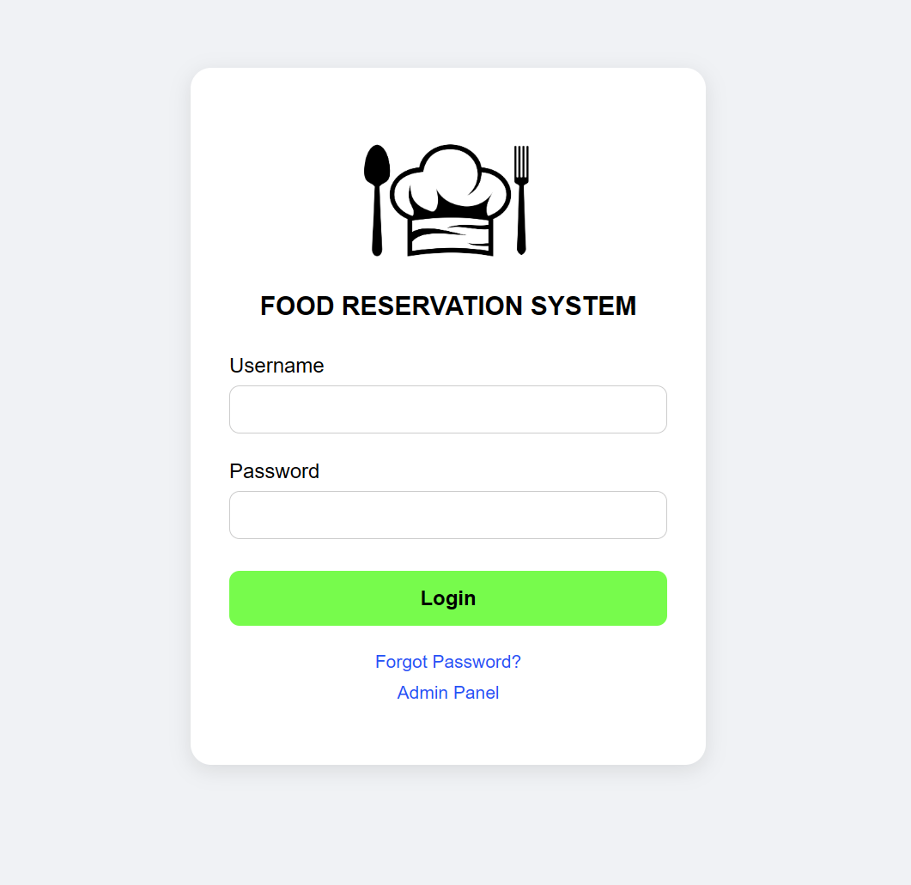
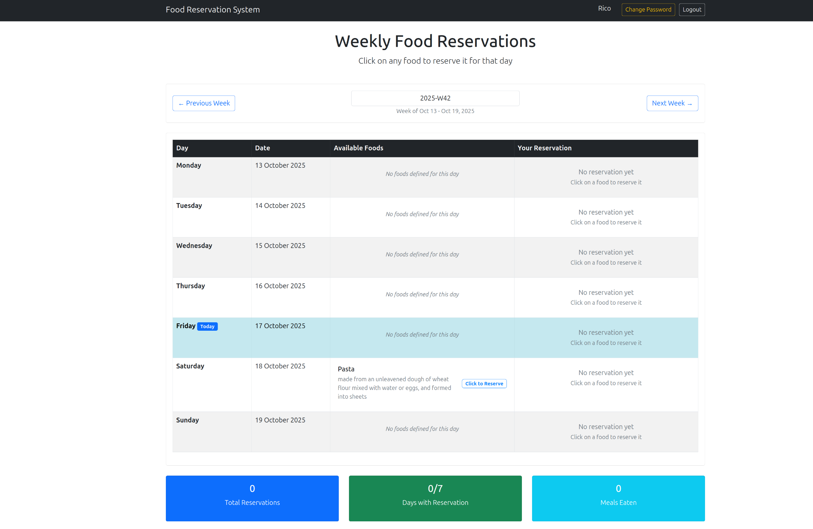
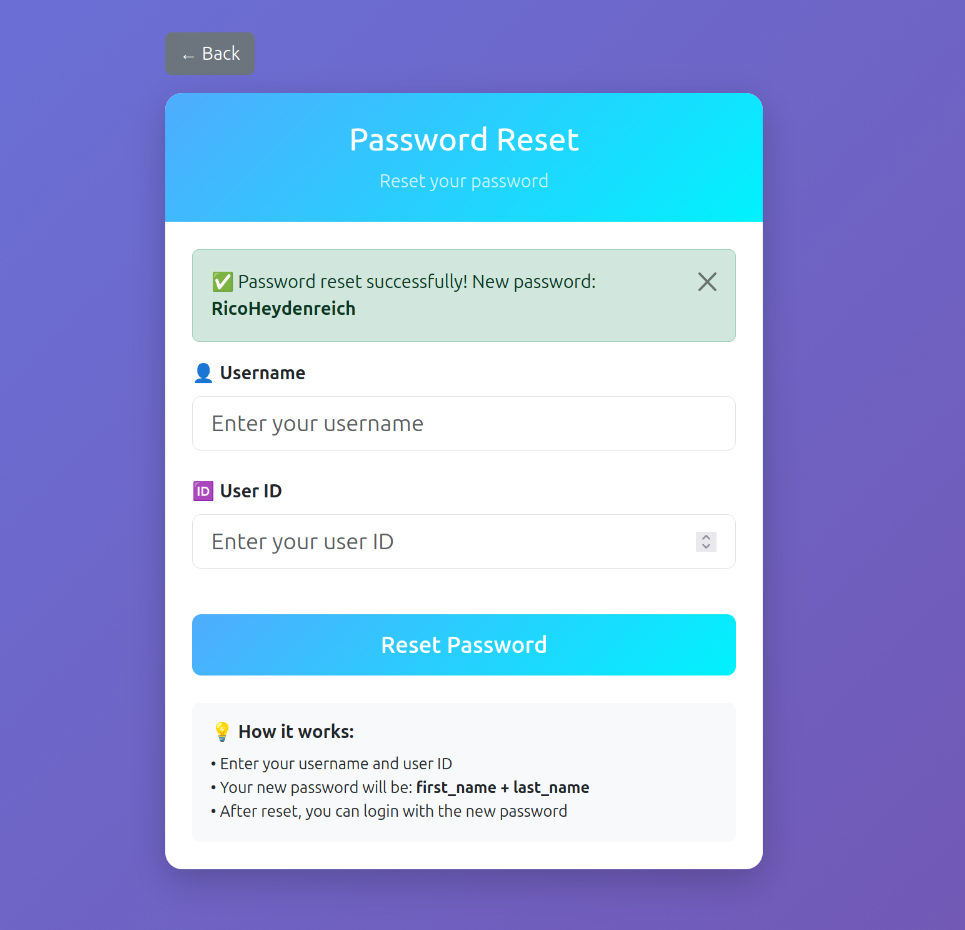
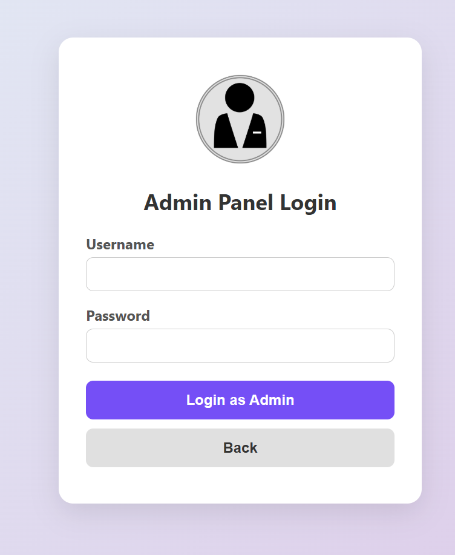
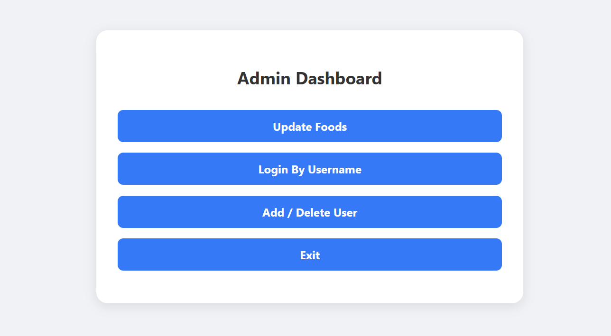

# Food Reservation System

A simple **food reservation system** using **laravel** with **docker**!


---
## Features
There is **admin** and other **users**
admin can define many foods for weekdays 
and users can login and reserve a food per day
users are created by admin and admin can delete them, create food or edit them.
admin can also login to user page by their username only!

## Usage :

The login page is the root (`/login`)<br>
<div align="center">

</div>
Users can use their username and password to log in.

The main page looks like this:<br>
<div align="center">

</div>
---
Or they can use **"forgot password"** which resets it to:  
→ `firstname + lastname`

The reset page looks like this:<br>
<div align="center">

</div>
---
Also users can change their password in the main page.

Admin can login using the **"admin panel"** button:<br>
<div align="center">

</div>
---
**Default Admin Credentials:** (`"admin"`, `"1234"`)  
*Change in: `src/app/http/controllers/adminlogincontroller.php`*

**Admin Dashboard Features:**
-  **Exit** - Return to login page
-  **Update foods** - Create/delete food items
-  **Login By Username** - Access user accounts directly  
-  **Add/Delete User** - User management

Admin dashboard:<br>
<div align="center">

</div>


### you can use Figma to see the pages :
[](https://www.figma.com/design/dfWs6aZErjRVqopVmlxpWU/reservation-system?m=auto&t=cmkYPUby41T4p42i-1)


### How database works :
This project use the **SQLITE** for database  ( can be changed in .env )
it has three tables:
- users : it keeps the users details
- foods : it keeps the food detail that admin define on any day
- reservation : it keeps any reservation details ( for each user and food and day)


---

## Instalation :
To try this web app, after installing Docker, you need to clone this repository and build the container using these commands:  
```bash
# Clone the repository
git clone https://github.com/ParsaHmi/Food-Reservation-System.git

# Navigate to project directory
cd Food-Reservation-System

# Build and start the containers
docker-compose up
#you can use "-d" flag to run it at background  
```

then you open the browser and search  
```bash
http://localhost:8888/login  
```
this is the root of the project !
